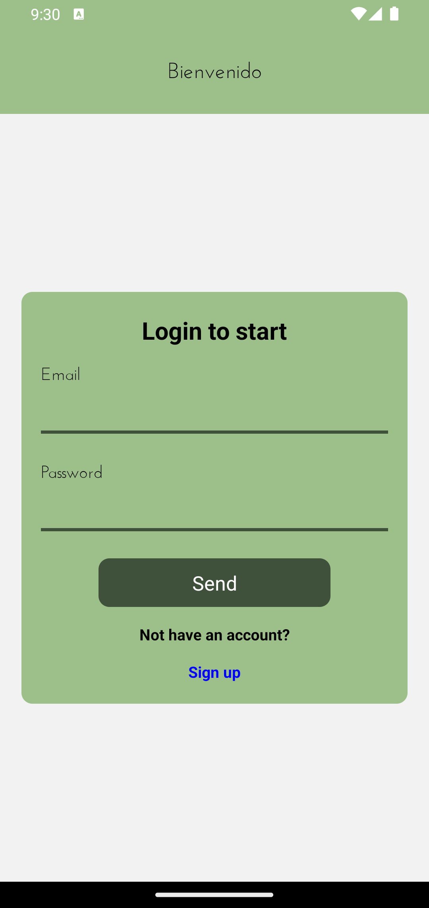
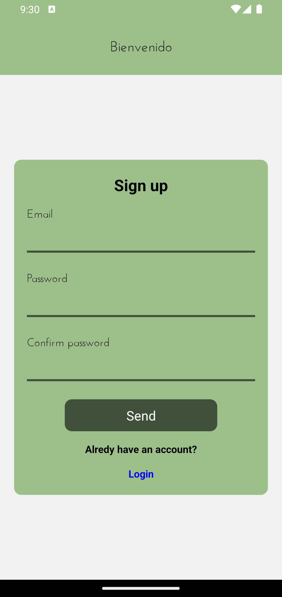
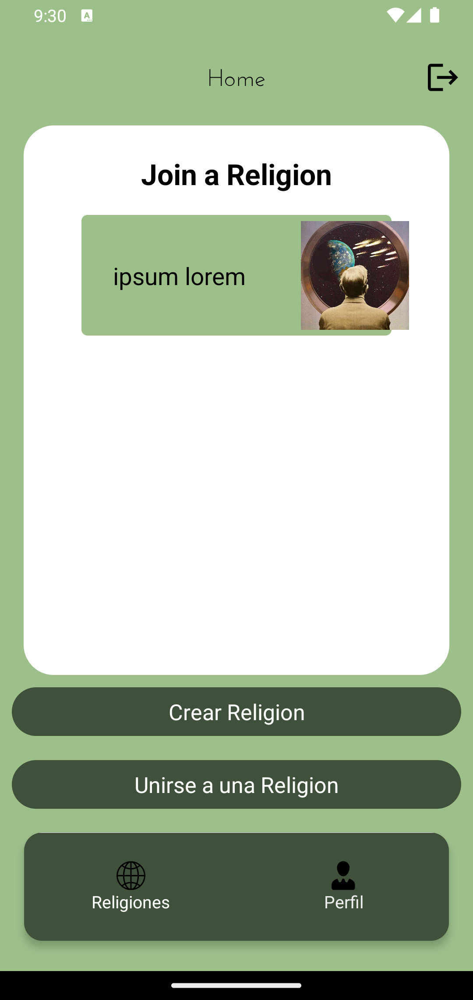
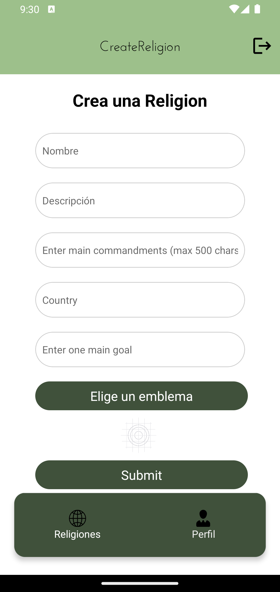
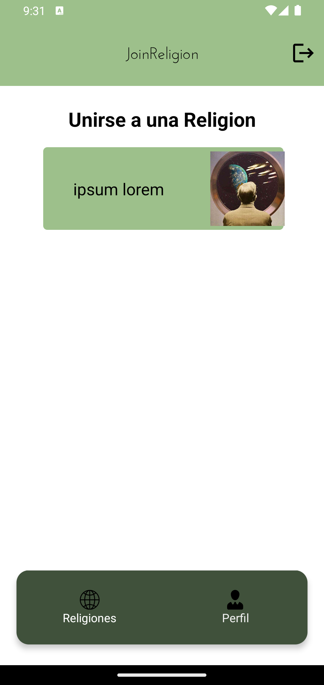
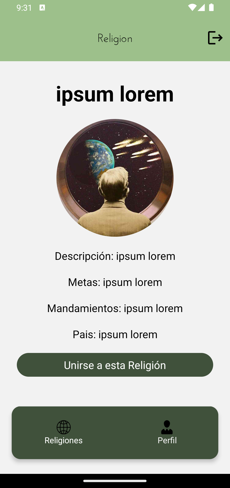

# Aplicación Cosmovisión

## Descripción
Cosmovisión es una aplicación móvil que permite a los usuarios crear y unirse a religiones, así como organizar reuniones basadas en la localización. Los usuarios pueden explorar y participar en diferentes religiones, crear las suyas propias y conectarse con personas afines.

## Características
- **Crear Religión:** Los usuarios pueden crear su propia religión con un conjunto único de creencias, metas y mandamientos.
- **Unirse a Religiones:** Explora y únete a religiones existentes creadas por otros usuarios.
- **Organizar Reuniones:** Utiliza la localización para organizar reuniones y eventos dentro de la aplicación.

## Tecnologías Utilizadas
- React Native
- Firebase Realtime Database
- Redux para la gestión del estado
- Expo para la carga de fuentes

## Inicio Rápido
### Prerrequisitos
- Node.js
- Expo CLI
- Cuenta de Firebase

### Funcionalidades Principales

1. Pantalla de Cuenta
Acceso seguro: Solo los usuarios autenticados pueden acceder a la pantalla de perfil y crear o unirse a Religiones.
Información del usuario: Muestra detalles del usuario, como nombre y dirección.

2. Autenticación con Firebase

Utiliza el sistema de autenticación de Firebase para gestionar el acceso de usuarios.
Permite a los usuarios iniciar sesión y registrarse de manera segura.

3. Pantalla Home

Muestra una lista de religiones donde el usuario es miembro, un boton de crear religion y un boton de unirse a una religion
Al hacer clic en uno de los botones, se navega a la pantalla  correspondiente. Al hacer click en alguno de los elementos de la lista, se navega al detalle de esa religion.

4. Pantalla de crear religion

El usuario puede ingresar nombre, descripcion, mandamientos, pais, objetivos y emblema para una nueva religion. 
Hay un boton para crear la nueva religion
Al hacer clic en el boton, se crea una nueva religion en la base de datos de firebase, se despliega un mensaje de exito o error y se navega a la pantalla home.

5. Pantalla de Unirse

Muestra una lista de todas las religiones de la base de datos
Al tocar alguna religion, navega al usuario a la pantalla de detalle para esa religion

6. Pantalla de detalle

Muestra los detalles de la religion elegida y un boton que permite al usuario unirse a esa religion. 
tiene un boton de unirse, el cual al ser presionado agrega el id del usuario a la relgion en la base de datos, se despliega un mensaje de exito o error y se navega a la pantalla home.

### Navegación Inferior
    const TabNavigator = () => {
  return (
        <Tab.Navigator
          screenOptions={{
            headerShown:false,
            tabBarShowLabel:false,
            tabBarStyle: styles.tabBar,
            initialRouteName: 'MainStack'

          }}
        >
          <Tab.Screen
             name="MainStack"
             component={MainStack}
             options={{
              tabBarIcon:({focused}) => <TabIcon icon="world-o" label="Religiones" focused={focused}/>
             }}
          />
            <Tab.Screen 
              name="ProfileStack" 
              component={ProfileStack}
              options={{
                tabBarIcon:({focused}) => <TabIcon icon="person" label="Perfil" focused={focused}/> 
              }}
             />
      </Tab.Navigator>
  )
}

export default TabNavigator

Pestaña 1 - Religions: Acceso a las funciones de religion
Pestaña 2 - Perfil: Información del usuario y carga de imagen de perfil.

### Tecnologías Utilizadas

- Firebase Authentication: Implementa el sistema de autenticación de Firebase para gestionar la seguridad de la aplicación.
- React Native Navigation Stack: Gestiona la navegación entre pantallas.
- React Native Navigation Buttom tap: Gestiona la navegación entre pestañas.
- Expo-Picker-Image: Facilita la carga de imágenes.
- Redux: Centraliza y gestiona el estado de la aplicación.
- RTK Query y Firebase: Realiza operaciones de lectura/escritura en la base de datos.

### Instalación

- Clona el repositorio: git clone https://github.com/FmosqueraCL/entregasrn
- Instala las dependencias: npm install
- Configura las claves de API para servicios externos (Expo-Location, Firebase, etc.).
- Configura las credenciales de Firebase en tu proyecto.
- Ejecuta la aplicación: npm start

### Contacto
Para preguntas o soporte, contacta a [francisco.mosquera.b@gmail.com].

